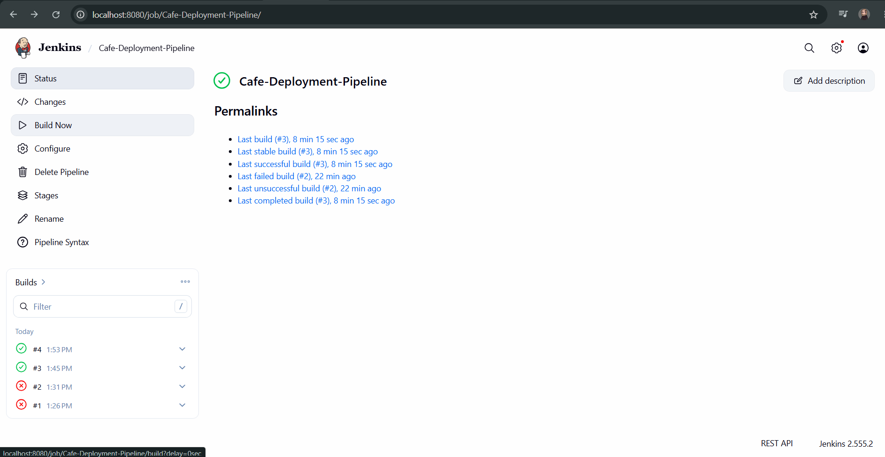
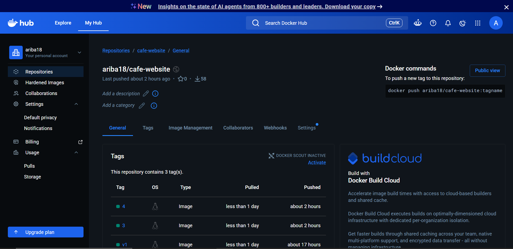
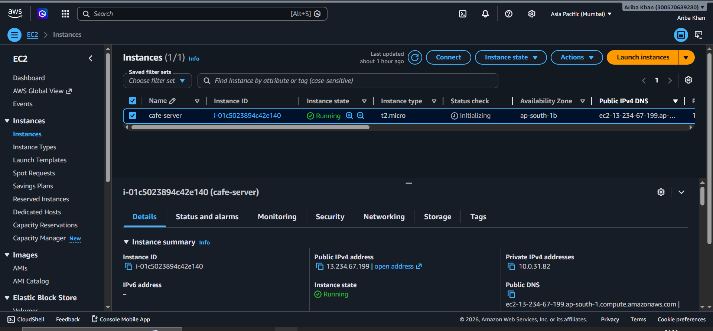
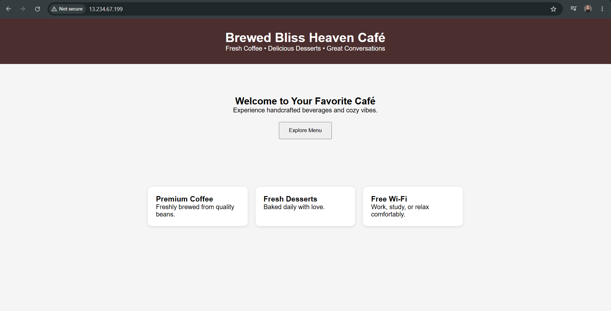

# Cafe Deployment Pipeline

## Project Overview

This project demonstrates a complete CI/CD pipeline for deploying a static cafe website using GitHub, Jenkins, Docker, Docker Hub, and AWS EC2.

The application is containerized using Docker, automatically built through Jenkins, pushed to Docker Hub, and deployed on an AWS EC2 instance.

## Architecture

```text
GitHub Repository
        ↓
Jenkins Pipeline
        ↓
Docker Build
        ↓
Docker Hub
        ↓
AWS EC2
        ↓
Docker Container
        ↓
Live Website
```

## Technologies Used

* Git & GitHub
* Jenkins
* Docker
* Docker Hub
* AWS EC2
* Nginx
* HTML
* CSS
* JavaScript
* Kubernetes (YAML manifests)

## Project Structure

```text
cafe-deployment-pipeline/
├── app/
│   ├── index.html
│   ├── style.css
│   └── script.js
├── kubernetes/
│   ├── deployment.yaml
│   └── service.yaml
├── Screenshots/
│   ├── EC2.png
│   ├── cafe_website.png
│   ├── dockerhub_repo.png
│   └── jenkins_success.png
├── Dockerfile
├── Jenkinsfile
├── .gitignore
└── README.md
```

## Docker Build

Build the image:

```bash
docker build -t ariba18/cafe-website:3 .
```

Run the container:

```bash
docker run -d -p 80:80 ariba18/cafe-website:3
```

## Jenkins Pipeline

The Jenkins pipeline performs:

1. Source code checkout from GitHub
2. Docker image build
3. Docker image push to Docker Hub
4. Deployment-ready image generation

## Docker Hub Repository

Docker image:

```text
ariba18/cafe-website
```

## AWS Deployment

The Docker image is deployed on an Amazon EC2 instance running Docker.

## Live Demo

**Important:** This project currently uses HTTP only.

Open the website using:

```text
http://13.234.67.199
```

Do not use HTTPS (`https://`) because SSL/TLS has not yet been configured.

## Features

* Automated CI/CD workflow
* Docker containerization
* Cloud deployment on AWS
* Source control with GitHub
* Jenkins automation
* Kubernetes manifests for future orchestration


## Project Screenshots

### Jenkins Pipeline Success



### Docker Hub Repository



### AWS EC2 Instance



### Live Website Running on AWS EC2




---
## Author : **Ariba Khan**
